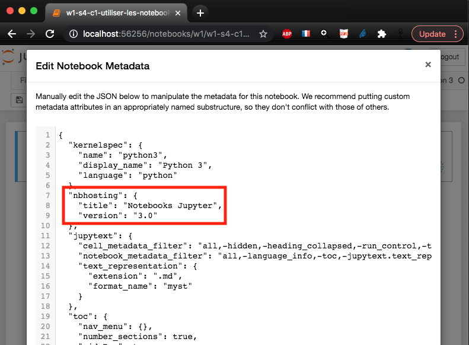
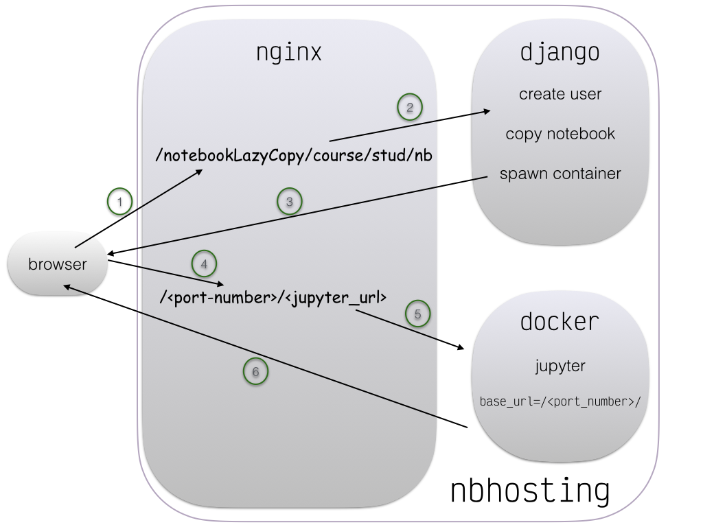

# notebook hosting architecture

This git repo contains a collection of utilities, that together make up the architecture behind `nbhosting.inria.fr` that is designed as a notebook-serving infrastructure.

First use case is for hosting notebooks in the context of MOOCs. See e.g. on fun-mooc.fr:

* [Python : des fondamentaux à l'utilisation du langage](https://www.fun-mooc.fr/courses/inria/41001S03/session03/about)
* [Bioinformatique : algorithmes et génomes](https://www.fun-mooc.fr/courses/inria/41003S02/session02/about)
* [Physique : préparation à l'entrée dans l'enseignement supérieur](https://www.fun-mooc.fr/courses/course-v1:Polytechnique+03009+session01/about)

******

# *Open-edX* teacher side

On the edx side, teacher would create a bloc typed as *ipython notebook* - note that the present repo does not address the code for the edx extension that supports this type of blocs (ref?); it is readily available at this point (jan. 2017) at `fun-mooc.fr`; see below for enabling it on a new course.

******

# *Open-edX* student side

Here's what a student would see;

******

# How does it work ?

In a nushell:

* the first time a student tries to open a notebook, nbhosting transparently creates her an account, together with a docker container;
* the first time a student opens a given notebook, this notebook is **copied** from the master course contents (more on this below) **into her container**; from that point on, her work for that notebook is independant from the master course
* containers are automatically stopped (i.e. frozen) when the student is inactive, to preserve computing resources; as a consequence, a student may have to wait 5 to 10 seconds when she shows up the first time or after idle time.

2 Additional features allow a student to:

* **Reset to Original**: copy again the master course into her container -
  **beware* that she will then lose her work on that notebook of course.
* **Share Static Version**: create a read-only snapshot of her notebook, that
  can then be used to share her work in the course's forum.

******

# Miscellaneous

## Enabling `New ipython notebook`

Before you can, as a teacher, add your first notebook-backed content in your edx
course, you need to enable that extension; in order to do that, go to Studio,
and then in your course's *Settings* → *Avanced*, and add `ipython` the *Avanced
Module List* setting, as illustrated below:

## Workflow / how to publish

Workflow is entirely based on git : a course is defined from a git repo, typically remote and public. In order to publish a new version of your notebook, you need to push them to that reference repo, and then instruct nbhosting to pull the new stuff:

## Docker image

Each course is deployed based on a specific docker image; for customization,
create a file named `nbhosting/Dockerfile` in your course repo.
Note that some magic recipes need to be applied in your image for proper
deployment, you should copy the beginning of [the code for our Python
course](https://github.com/flotpython/course/blob/master/nbhosting/Dockerfile),
although it is often desirable to select a fixed version for the bottom image.

That image can then be rebuilt from the website. New image will be deployed
incrementally, essentially as running containers get phased out when detected as
inactive; this means it can take a day or two before all the students can see
the upgrade.

##  Notebook metadata

Each notebook is displayed with a label and version number; like e.g. on the example above . For tweaking that, use your notebook's metadata and set these two items:

## Statistics

Statistics are available, for visually inspecting data like:
* how many different students have showed up and when,
* which notebooks were opened and when,
* computing resources like created/active containers, disk space, CPU load...

## Staff

You can declare some people as being staff; this is used by nbhosting only for
discarding accesses done by these people, when putting stats together. A convenience button also allows to trash all the working files for people declared as staff, which can come in handy to be sure that staff people always see the latest pushed version.

For declaring somebody as staff, you need to somehow locate that person's hash, as exposed by edx.

******

# Dataflow - `nbhosting` side

Here's the general principle of how of works

## silent mode (in an iframe, behind a MOOC system)

* Open-edX forges a URL, like the one shown above, with `student` replaced with the hash of some student id
* This is caught by nginx, that runs forefront; the `notebookLazyCopy/` prefix is routed to a django application, that primarily does this
  * create a linux user if needed
  * create a copy of that notebook for the student if needed
  * spawns a (docker) jupyter instance for the couple (course, student)
  * redirects to a (plain https, on port 443) URL that contains the port number that the docker instance can be reached at (on localhost via http)

***Note*** that `notebookLazyCopy` used to be named `ipythonExercice`, which is still supported for backward compatibility.

## classroom mode 

The classroom mode uses a similar approach, but uses a URL that
mentions `notebookGitRepo/` instead of `notebookLazyCopy/`; the
behaviour is mostly the same except for the policy used to create
notebooks in the student space; when the visited notebook is missing
there, `notebookGitRepo` triggers a git clone operation, instead of
copying notebooks individually.

## summary

As a summary:

# TODO

See [Issues on github](https://github.com/parmentelat/nbhosting/issues) for an up-to-date status.
