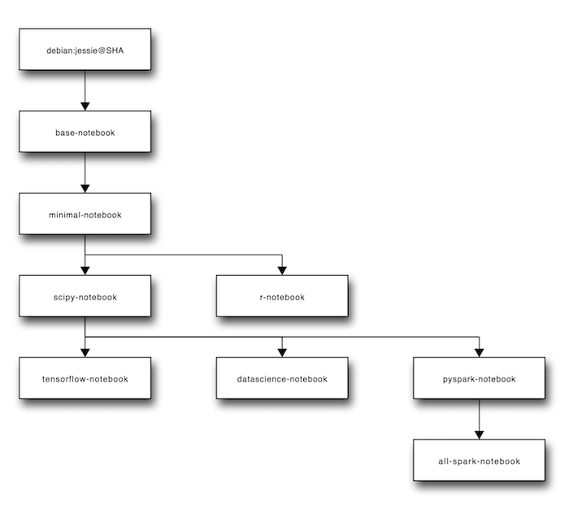

# snapshot of `docker-stacks`

* Feb 1st 2017
* from [https://github.com/jupyter/docker-stacks]()

## inheritance

## sizes and python(s)

| Name                 | Pys | Size |
|----------------------|-----|------|
| all-spark-notebook   | 2+3 | 1.8G |
| base-notebook        | 3   | 160M |
| datascience-notebook | 2+3 | 2.2G |
| minimal-notebook     | 3   | 790M |
| pyspark-notebook     | 2+3 | 1.6G |
| r-notebook           | R   | 960M |
| scipy-notebook       | 2+3 | 1.3G |
| tensorflow-notebook  | 2+3 | 1.8G |

