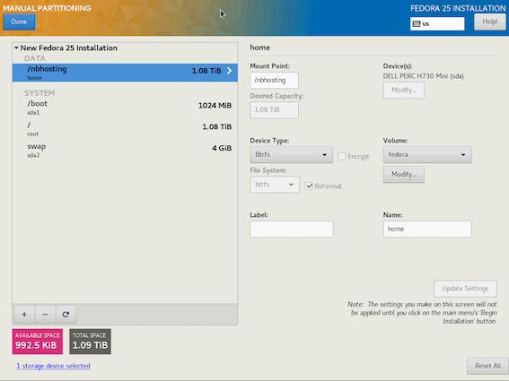

# Fedora installation and setup

* this document is about setting up `nbhosting` from metal, i.e. right after a fresh install.
* date: July 12 2017
* based on fedora 25
* **SSL certificates**: in case of a reinstallation:
  * ***don't forget*** to back up SSL certificate and especially ***the private key***
  * this is stored in dir `/root/ssl-certificate/`

# see also

* companion file `configuration.md` is an attempt at describing all the places where changes can be needed

# disk partitioning

## WARNING

**Something to think about before setting up a production box**:
it might make more sense to actually cut **2 separate btrfs partitions**, instead of a single one like it is exposed below; having a completely separate btrfs partition for hosting the docker images and containers may turn out to be more convenient, especially when a reset is needed. Remember that it takes less than a second to create a new btrfs filesystem on a partition, while it can take hours to properly remove images and containers using docker one by one, so there's that.


## system *vs* application

The requirement is to have `/nbhosting` mounted on a `btrfs` partition somehow.

Here's the choice that I made with the fedora installation program after selecting the `btrfs` layout:

 .

On `thermals.inria.fr` as of the setup in July 2017:

```
[root@thermals ~]# df -hT
Filesystem     Type      Size  Used Avail Use% Mounted on
devtmpfs       devtmpfs  126G     0  126G   0% /dev
tmpfs          tmpfs     126G     0  126G   0% /dev/shm
tmpfs          tmpfs     126G  1.9M  126G   1% /run
tmpfs          tmpfs     126G     0  126G   0% /sys/fs/cgroup
/dev/sda3      btrfs     1.1T  1.4G  1.1T   1% /
/dev/sda3      btrfs     1.1T  1.4G  1.1T   1% /nbhosting
tmpfs          tmpfs     126G  4.0K  126G   1% /tmp
/dev/sda1      ext4      976M   98M  811M  11% /boot
tmpfs          tmpfs      26G     0   26G   0% /run/user/0
```
## how `nbhosting` uses this space

* `/nbhosting/dockers/`

   will be handed over to docker as its main area for storing images and snapshots, basically all the copy-on-write powered images
* `/nbhosting/courses-git/`

    is where we create git repo clones, used as a basis for exposing contents to the containers
* `/nbhosting/courses/`

   contains an extract of the git repo with all found notebooks
* `/nbhosting/students`

   is the root for the homedirectories created for students as they show up
* **others subdirs**

  like `logs`, for logs, `raw` for collecting events and counts later processed as statistics, ...

## valuable data

The data that should be backed up is the one in

* `/nbhosting/students`

   has the copies made by the students, together with their `.nbautoeval` trace files

* `/nbhosting/raw`

  is designed to be low-to-mid noise, and to take reasonable space; it is enough to reconstruct all the statistics displayed in the web pages.

* Worth being mentioned as well in this area are the various dockerfiles, that I assume are stored in the `nbhosting` git repo under `docker-images`, but well, technically this is important data as it describes the contents of each course image.


# Configs

Notes

* `/etc/sysconfig/docker` is the place where we define `/nbhosting/dockers` as being `docker`'s workspace
* we want to use a static `iptables` config, and ***not firewalld*** that will just screw it all up for us
* likewise, we need to turn off SElinux
* the default `/etc/sudoers` does not require a tty to use `sudo`; we need this to be the case, be aware that mentioning `Defaults    requiretty` in that file will break `nbhosting`.

## ssh
After raw install of fedora, do the usual:

* enable root access via ssh
* disable password authentication for sshd

## iptables vs firewalld

```
dnf install -y iptables-services
systemctl mask firewalld.service
systemctl enable iptables.service
```

## install git and docker

```
dnf -y install git docker
cd /root
git clone https://github.com/parmentelat/nbhosting.git
```

## fedora basics, and docker setup


```
cp etc/sysconfig/iptables /etc/sysconfig/iptables
cp etc/selinux/config /etc/selinux/config
sed -i -f etc-sysconfig-docker.sed /etc/sysconfig/docker

systemctl enable docker
systemctl start docker
```

## reboot

In order to apply changes (esp. regarding selinux, and iptables)

*************************

# App install

## packages / dependencies

***IMPORTANT NOTES*** about python libraries

* ***NOTE*** Be careful to **not install `python3-django` from rpm** as this would give you 1.9 and the code would break.

* See `capture-versions.sh`  and files named `VERSIONS*` that give more details of what was running on nominal deployments, and on the actual split between what was installed with `dnf` and what comes from `pip`

```
dnf -y install python3
dnf -y install nginx
dnf -y install -y uwsgi uwsgi-plugin-python3
pip3 install --upgrade pip setuptools
pip3 install --upgrade Django
# for nbh-monitor
pip3 install aiohttp docker

# see VERSIONS for python libraries
```

****

## SSL certificates

The `nginx` config has it that the SSL certificate used by the main entry point (in our case `nbhosting.inria.fr`) be located in `/root/ssl-certificate/`, and more specifically

```
$ egrep 'server_name|ssl_certificate' nginx/nbhosting.conf
    server_name nbhosting.inria.fr;
    ssl_certificate /root/ssl-certificate/bundle.crt;
    ssl_certificate_key /root/ssl-certificate/nbhosting.inria.fr.key;
```

Make sure to install these 2 files properly.

## initial install

We do not expose any packaging; instead the workflow is to

* create a git clone in `/root/nbhosting`
* run the `install.sh` script in here to install (or, update just the same)

```
cd /root/nbhosting
git pull
./install.sh
```

## admin (create super user)

Initialize the admin superuser; preferably user `profs` - this is what will allow to enter the admin web interface:

```
cd /root/nbhosting/nbhosting
python3 manage.py migrate
python3 manage.py createsuperuser
```


## update to a more recent version

```
cd /root/nbhosting
git pull
./install.sh
```

## use

There's a single command `nbh` that's an entry point into all the features exposed to the CLI; see the list with

```
nbh --help
```

****

# Install courses

## initialisation (item 1 : pull from git)

* create a course (the git repo in fact)

  will go in `/nbhosting/courses-git/flotpython/`

```
nbh course-init flotpython https://github.com/parmentelat/flotpython.git
```

## updates (item 2 : update from git)

* for now this **needs to be done at least one**
* as it will create the actual course notebooks master area

  in `/nbhosting/courses/flotpython`

```
nbh course-update-from-git flotpython
```

## image (item 3 : build image for course)

* this assumes a dockerfile has been created for that course

```
cd /root/nbhosting/docker-images
make flotpython
```

## settings (optional)

### what ?

There are a few settings available for a course; as of this writing:

* docker image name to use; the default is the coursename, so `flotpython` looks for image `flotpython`; however you could also create flotpython-session1 that uses image `flotpython`

* list of static dirs; the default here is `media` and `data` which are the conventions hard-wired in the previous notebook hosting system; when trying to deploy 'Data Science Handbook' it appeared that this should be configurable

### how ?

These settings are stored in e.g.

* `/nbhosting/courses/flotpython/.statics`
* `/nbhosting/courses/flotpython/.image`

that can be edited directly, or be changed with `nbh course-settings --help`

### when ?

The settings are used at **container-creation** time; meaning that if a student has come at least once, her container exists and the course settings will be mostly ignored.

Same goes of course if a chnge is made to the course image (like, adding a python library).

This being said, a stopped container can be safely removed manually, causing it to be re-created the next time a student shows up. But tearing down thousands of containers can be time-consuming and create a big load on the box.


****

# Ops

## services

as far as `systemd` and `journactl` are concerned:

* `nginx`
  * fedora's nginx service as-is
* `nbh-uwsgi`
  * the django app runs inside nginx through uwsgi
* `nbh-monitor`
  * monitor performs housecleaning (kill idle containers), and on the side also gathers raw data for statistics

## logs

Additional logs go into

* `/nbhosting/logs/nbhosting.log`
* `/nbhosting/logs/monitor.log`
* `/var/log/nginx/{error,acces}.log`
* also each docker container can be probed for its logs
  * `docker logs flotpython-x-thestudentid`

## visual stats

* https://nbhosting.inria.fr/nbh/ is the - very rough - front-end for the django app
* it targets only the admin of course, and the login/passwd for the admin user was created above (see `manage.py createsuperuser`)
* main page is `https://nbhosting.inria.fr/nbh/courses`; each course comes with its stats page; probably subject to changes, so you'd better see for yourself, but as of now:
  * number of registered students
  * number of notebooks read
  * number of containers/kernels
  * disk space
  * cpu load

## rain check
* it is also possible to open any of the notebooks: go to the `notebooks` page for a given course (i.e. not the `stats` page); clicking any of the notebooks will open it as if opened by a student whose name is `anonymous`.
* this is a convenient way to check the course is up and running - in particular, make sure you have built the image for that course !

# comfort

Some additions of mine to feel a little more at home:

```
cd

dnf -y install git emacs-nox curl

git clone git://diana.pl.sophia.inria.fr/diana.git
diana/bash/install.sh -b 5 systemd
echo "source /root/nbhosting/zz-devel/logaliases" >> .bash-private.ish
```
