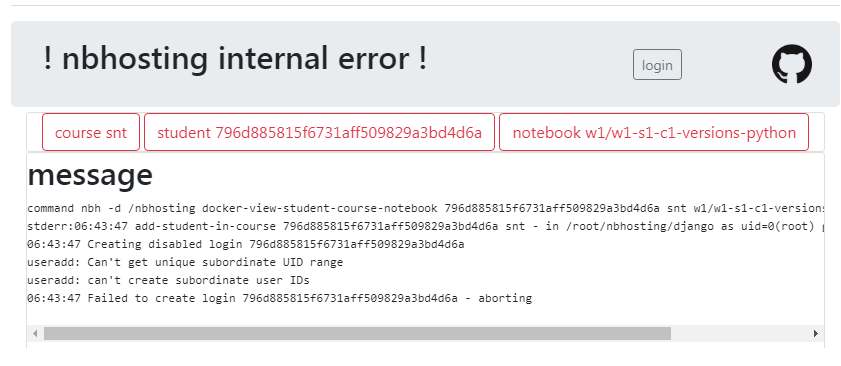

# allocating uids


## symptom



* during initial deployments we've run into an issue where the system was
  running out of uid space for user creation

* symptom is similar to the picturte above


## historical note

* I can't say for sure if this issue will show up on a freshly installed fedora box
* thing is I've been playing with using user namespaces at some point of the development, objective being to map a host uid to 1000 in the container; I never got around to that actually
* in any case, my boxes all have `/etc/subuid` and `/etc/subgid`, which docker uses as documented here https://docs.docker.com/engine/security/userns-remap/


## quick fix

* simpler fix is to edit `/etc/login.defs` and to increase
  `SUB_UID_MAX` and `SUB_GID_MAX`

## proper dimensioning

* default `login.defs` comes with a **very large** `SUB_UID_COUNT` set to `65536`
* in a first approach I lowered this to `1000` and the system has run for quite some time on this setting
* however upon closer inspection of https://docs.docker.com/engine/security/userns-remap/, it appears that `1000` is exactly one too little, since the only container-uid that we are interested in is `jovyan` numbered 1000
* but more importantly, we do not appear to enable the feature that docker has about user namespaces, so all this fuss is completely utterly pointless and counterproductive.

So here's a recommendation:
* still use 1024 as a sub id count,
* bump max sub id to $2^{32}-1$
* which now should account for in the order of $2^{22}$ users, 4 millions, we should be good this time

```python
UID_MIN                100000
UID_MAX               1000000
# System accounts
SYS_UID_MIN               201
SYS_UID_MAX               999

#
# Min/max values for automatic gid selection in groupadd
#
GID_MIN                100000
GID_MAX               1000000
# System accounts
SYS_GID_MIN               201
SYS_GID_MAX               999

# see fedora/passwd-dimensioning.md
SUB_UID_MIN                 1000000
SUB_UID_MAX              4294967295
SUB_UID_COUNT                  1024
SUB_GID_MIN                 1000000
SUB_GID_MAX              4294967295
SUB_GID_COUNT                  1024
```

## resetting

* when we swap boxes between devel and prod, we do **reset all passwd entries**
* this is no big deal because nbhosting always makes sure the students files have proper ownership
* however, it is also important to **reset `/etc/subuid` and `/etc/subgid`** in order to actually free id space
* if all this ends up working, we **should no longer need to reset passwd entries at all**


Tricks for sorting passwd and group

```bash
sort -t: -k3 -n passwd > passwd.sorted
mv passwd.sorted passwd
pwconv
sort -t: -k3 -n group > group.sorted
mv group.passwd group
grpconv
```
